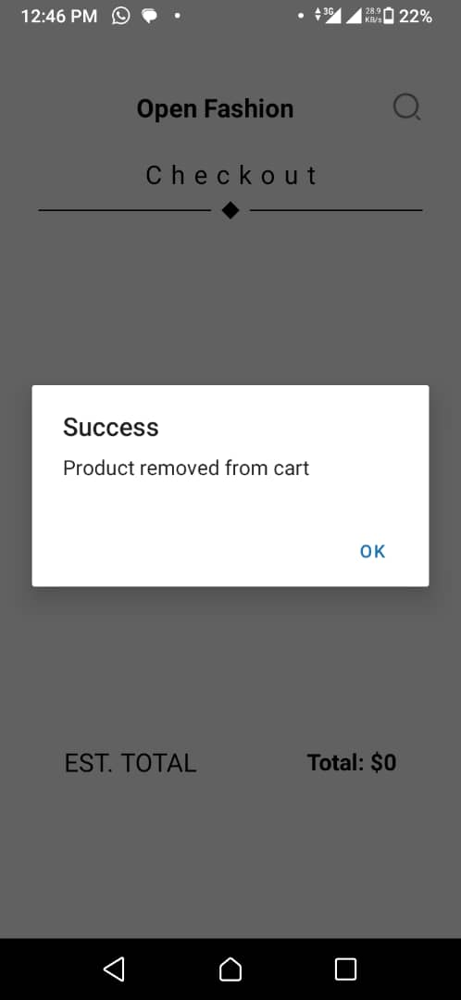
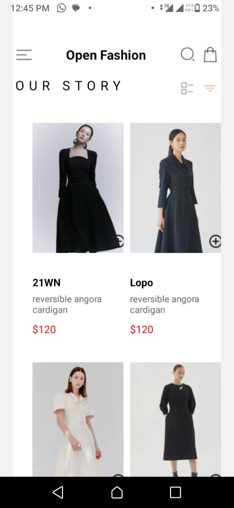
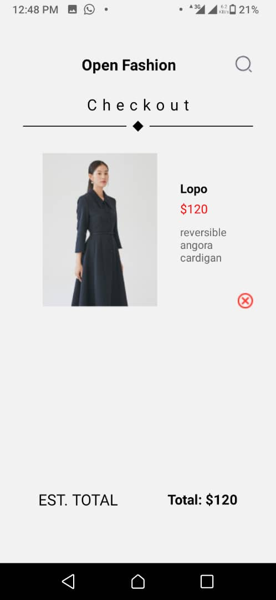
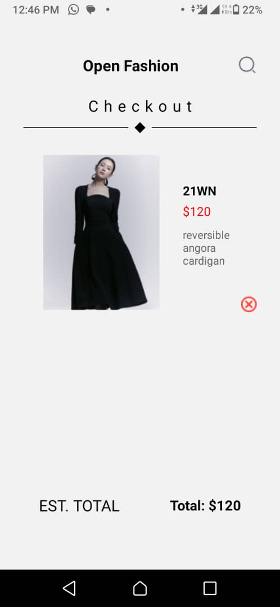

# -rn-assignment6-11348840

## DCIT202 Mobile Application Development Assignment 6

### Description

This project is a simple mobile application developed with React Native. The app allows users to view a list of products, add products to a cart, remove products from the cart, and view the items in the cart. The cart items are stored locally on the device using AsyncStorage.

### Features

- **Home Screen**: Displays a list of available products with an "Add to Cart" button for each product.
- **Checkout Screen**: Displays the selected items with a "Remove from Cart" button for each item.
- **Local Storage**: Uses AsyncStorage to store selected items locally on the device.

### Components

- **HomeScreen**: Displays the list of products and allows users to add products to the cart.
- **CheckoutScreen**: Displays the selected items and allows users to remove items from the cart.
- **ProductCard**: A reusable component for individual products.

### Dependencies

- React Navigation: Used for navigating between the Home and Cart screens.
- AsyncStorage: Used for storing and retrieving cart items locally on the device.

### Screenshots

